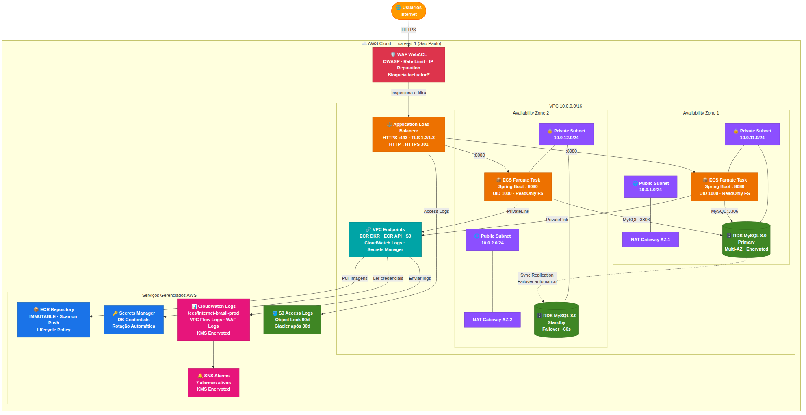

# Infraestrutura de Produção — ECS Fargate + RDS MySQL

Stack CloudFormation completa para a aplicação **Internet Brasil** em produção na AWS (sa-east-1). Provisiona toda a infraestrutura de rede, computação, banco de dados, segurança e observabilidade como código.

---

## Arquitetura



A arquitetura é **multi-AZ por design**: cada camada tem recursos em duas Availability Zones independentes. Uma falha completa de AZ não causa downtime.

---

## Componentes

### Rede
| Recurso | Configuração |
|---|---|
| VPC | `10.0.0.0/16`, DNS habilitado |
| Subnets públicas | `10.0.1.0/24` e `10.0.2.0/24` (AZ-1 e AZ-2) |
| Subnets privadas | `10.0.11.0/24` e `10.0.12.0/24` (AZ-1 e AZ-2) |
| NAT Gateways | Um por AZ — falha de AZ não afeta a outra |
| VPC Endpoints | ECR DKR, ECR API, S3 (Gateway), CloudWatch Logs, Secrets Manager |

> Os VPC Endpoints evitam que o tráfego para serviços AWS passe pelo NAT Gateway, reduzindo custo e mantendo os dados na rede interna da AWS.

### Segurança
| Recurso | Configuração |
|---|---|
| WAF WebACL | Rate limit (2000 req/5min/IP), IP Reputation List, OWASP Common, Known Bad Inputs, SQLi. Bloqueia `/actuator/*` exceto `/actuator/health` |
| TLS | Somente TLS 1.2/1.3 (`ELBSecurityPolicy-TLS13-1-2-2021-06`) |
| Desync Mitigation | `strictest` — previne HTTP Request Smuggling |
| KMS (CMK) | Chave gerenciada pelo cliente para Log Groups, SNS e ECR |
| Secrets Manager | Senha do RDS gerenciada e rotacionada automaticamente pela AWS |
| Security Groups | ALB → ECS → RDS com tráfego mínimo necessário; RDS sem egress |
| Container | `User: 1000:1000` (não-root), `ReadonlyRootFilesystem: true`, tmpfs `/tmp` com `noexec,nosuid,nodev` |

### Computação
| Recurso | Configuração |
|---|---|
| ECS Cluster | Fargate, Container Insights habilitado |
| Task Definition | CPU e memória parametrizáveis; imagem do ECR desta stack |
| ECS Service | `DesiredCount: 2`, `MinimumHealthyPercent: 100` (zero-downtime deploy), Circuit Breaker com rollback automático |
| Auto Scaling | CPU ≥ 70% ou Memória ≥ 80% → escala de 2 a 10 tasks |

### Banco de Dados
| Recurso | Configuração |
|---|---|
| RDS MySQL 8.0 | `MultiAZ: true`, failover automático em ~60s |
| Storage | `gp3`, criptografado, auto scaling até 500 GB |
| Backups | Retenção de 7 dias, janela `02:00–03:00 UTC` |
| Parameter Group | `slow_query_log`, `innodb_buffer_pool_size = 75% RAM`, `utf8mb4` |
| Performance Insights | Habilitado, 7 dias de retenção |
| Enhanced Monitoring | 60 segundos de granularidade |
| CloudWatch Logs | Exporta logs `error` e `slowquery` |

### Observabilidade
| Recurso | O que monitora |
|---|---|
| Dashboard CloudWatch | ALB requests/erros, latência p50/p95/p99, ECS CPU/memória/tasks, RDS CPU/conexões/IOPS/storage |
| ALB 5XX Alarm | > 10 erros em 5 min |
| ECS High CPU Alarm | CPU média > 80% por 10 min |
| ECS Low Task Count | Tasks rodando < 2 por 2 min |
| RDS High Connections | Conexões > 40 |
| RDS Low Storage | Espaço livre < 5 GB |
| ALB High Latency | Latência média > 2s por 10 min |
| WAF Blocked Requests | > 100 bloqueios em 5 min |

---

## Pré-requisitos

- AWS CLI configurada com permissões de admin
- Certificado ACM válido para o domínio (deve existir antes do deploy)
- Imagem Docker com usuário não-root (`USER 1000`) publicada no ECR após o primeiro deploy
- Node.js ≥ 18 (opcional, para validar o template localmente)

---

## Parâmetros

| Parâmetro | Obrigatório | Descrição |
|---|---|---|
| `ACMCertificateArn` | ✅ | ARN do certificado ACM para HTTPS |
| `AppImageTag` | ✅ | Tag da imagem Docker — formato `v1.2.3` ou `sha-abc1234` |
| `DBMasterUsername` | ✅ | Usuário master do RDS (evite `admin`, `root`, `master`) |
| `DBInstanceClass` | ❌ | Classe da instância RDS (default: `db.t3.small`) |
| `DBAllocatedStorageGB` | ❌ | Storage inicial em GB (default: `50`) |
| `ECSTaskCpu` | ❌ | CPU da task em unidades (default: `512` = 0.5 vCPU) |
| `ECSTaskMemory` | ❌ | Memória da task em MB (default: `1024`) |
| `AlarmEmail` | ❌ | E-mail para alertas do CloudWatch (deixe vazio para não configurar) |

---

## Deploy

### Primeiro deploy

```bash
# 1. Criar a stack
aws cloudformation create-stack \
  --stack-name internet-brasil-prod \
  --template-body file://infra.yaml \
  --capabilities CAPABILITY_NAMED_IAM \
  --parameters \
    ParameterKey=ACMCertificateArn,ParameterValue=arn:aws:acm:sa-east-1:123456789012:certificate/xxx \
    ParameterKey=AppImageTag,ParameterValue=sha-abc1234 \
    ParameterKey=DBMasterUsername,ParameterValue=appuser \
    ParameterKey=AlarmEmail,ParameterValue=ops@exemplo.com

# 2. Aguardar criação completa (~15-20 min)
aws cloudformation wait stack-create-complete \
  --stack-name internet-brasil-prod

# 3. Obter URI do repositório ECR para o CI/CD
aws cloudformation describe-stacks \
  --stack-name internet-brasil-prod \
  --query "Stacks[0].Outputs[?OutputKey=='ECRRepositoryUri'].OutputValue" \
  --output text
```

### Atualização de infraestrutura

```bash
aws cloudformation update-stack \
  --stack-name internet-brasil-prod \
  --template-body file://infra.yaml \
  --capabilities CAPABILITY_NAMED_IAM \
  --parameters \
    ParameterKey=ACMCertificateArn,UsePreviousValue=true \
    ParameterKey=AppImageTag,UsePreviousValue=true \
    ParameterKey=DBMasterUsername,UsePreviousValue=true
```

### Deploy de nova versão da aplicação

```bash
# Apenas atualiza a tag da imagem — não recria a infraestrutura
aws cloudformation update-stack \
  --stack-name internet-brasil-prod \
  --template-body file://infra.yaml \
  --capabilities CAPABILITY_NAMED_IAM \
  --parameters \
    ParameterKey=AppImageTag,ParameterValue=v2.1.0 \
    ParameterKey=ACMCertificateArn,UsePreviousValue=true \
    ParameterKey=DBMasterUsername,UsePreviousValue=true
```

> **Zero downtime garantido:** `MinimumHealthyPercent: 100` faz o ECS subir as novas tasks antes de derrubar as antigas. Se o deploy falhar, o Circuit Breaker faz rollback automático.

---

## CI/CD — Fluxo Recomendado

```
git push → CI build → docker build → ECR push (tag: sha-<commit>)
        → CloudFormation update (AppImageTag=sha-<commit>)
        → ECS rolling deploy (zero downtime)
```

### Exemplo com GitHub Actions

```yaml
- name: Push para ECR
  run: |
    aws ecr get-login-password | docker login --username AWS --password-stdin $ECR_URI
    docker build -t $ECR_URI:sha-${{ github.sha }} .
    docker push $ECR_URI:sha-${{ github.sha }}

- name: Deploy via CloudFormation
  run: |
    aws cloudformation update-stack \
      --stack-name internet-brasil-prod \
      --template-body file://infra.yaml \
      --capabilities CAPABILITY_NAMED_IAM \
      --parameters \
        ParameterKey=AppImageTag,ParameterValue=sha-${{ github.sha }} \
        ParameterKey=ACMCertificateArn,UsePreviousValue=true \
        ParameterKey=DBMasterUsername,UsePreviousValue=true
```

---

## Credenciais do Banco

A senha do RDS é gerenciada automaticamente pelo Secrets Manager. Para acessar no código da aplicação:

```java
// Java/Spring Boot — adicionar ao application.yml:
// spring.datasource.url=jdbc:mysql://${RDS_ENDPOINT}:3306/appdb
// Buscar usuario e senha via SDK:

SecretsManagerClient client = SecretsManagerClient.create();
GetSecretValueResponse secret = client.getSecretValue(
    GetSecretValueRequest.builder()
        .secretId(System.getenv("RDS_SECRET_ARN"))
        .build()
);
// secret.secretString() retorna JSON: {"username":"...", "password":"..."}
```

O ARN do segredo está no output `RDSMasterSecretArn` da stack.

---

## Observações de Segurança

- **Container não-root:** o Dockerfile deve incluir `RUN useradd -u 1000 appuser && USER appuser`
- **Filesystem somente-leitura:** a aplicação deve escrever apenas em `/tmp` — logs devem ir para stdout/stderr (capturados pelo CloudWatch)
- **GuardDuty e CloudTrail** não são provisionados por esta stack — devem ser habilitados no nível da conta AWS via AWS Organizations ou console
- **WAF em modo Block:** todas as managed rules estão em modo de bloqueio. Se houver falsos positivos após o deploy, ajuste via `OverrideAction: Count: {}` temporariamente enquanto investiga

---

## Estrutura dos Arquivos

```
.
├── infra.yaml        # Stack CloudFormation completa
├── arquitetura.png   # Diagrama da arquitetura
└── README.md         # Este arquivo
```

---

## Outputs da Stack

| Output | Descrição |
|---|---|
| `ALBDNSName` | DNS do load balancer — configure no Route 53 |
| `ECRRepositoryUri` | URI do repositório ECR para push de imagens |
| `RDSEndpoint` | Endpoint do banco de dados |
| `RDSMasterSecretArn` | ARN do segredo com as credenciais do banco |
| `LogsKMSKeyArn` | ARN da CMK para auditoria de criptografia |
| `WAFWebACLArn` | ARN do WAF — use para associar a um CloudFront futuro |
| `AlarmsSNSTopicArn` | ARN do SNS — adicione subscriptions para Slack/PagerDuty |
